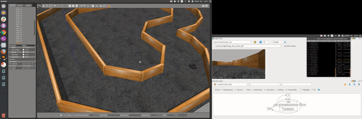

# Otonom Robot Simülasyonu

Bu Repo' da turtlebot3 simulasyon modeli kullanılarak derin öğrenme testleri yapılmıştır. 

Derin öğrenme framework olarak tensorflow alt yapısında çalışan keras kullanılmıştır. Eğitimler test pistinde araç önce ileri doğru sonra geri doğru giderken verilerin kaydedilmesi ile yapılmıştır.

Simülasyonu başlatmak için

* roslaunch robot_sim start_sim.launch

Simülasyonu eğitim yada tahmin modunda başlatmak için 

* robot-sim/launch/start_sim.launch

"mode" parametresini test olarak değiştirin.

Benzer duvar ve yer desenli farklı bir pistte eğitilen aracın pistte otonom olarak sürüşüne [bağlantıdan](https://www.youtube.com/watch?v=FVX2JWJV_X4&t=22s) ulaşabilirsiniz.

